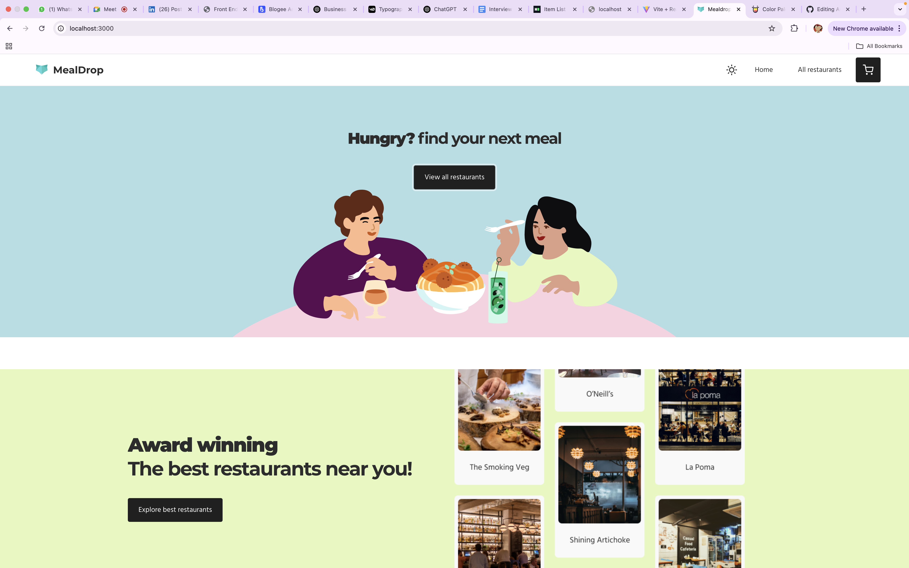

#Food Delivery App

 A modern food delivery app built using the latest React ecosystem tools. 
 ###


 
 
---

## 🚀 Tech Stack

- **React** (with Hooks)
- **TypeScript**
- **Styled Components** – CSS-in-JS styling
- **Redux Toolkit** – for state management
- **React Router** – routing solution
- **Storybook** – UI component explorer
- **React Testing Library** – for unit and integration testing

---

## 📦 Getting Started

Clone the repo and install dependencies:

```bash


yarn install
yarn start
